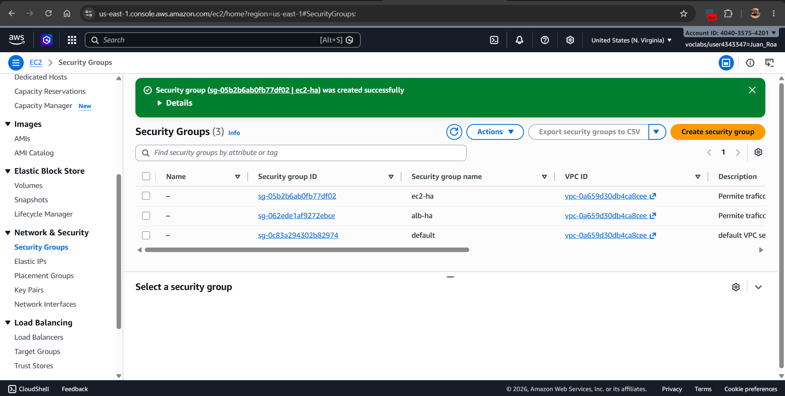
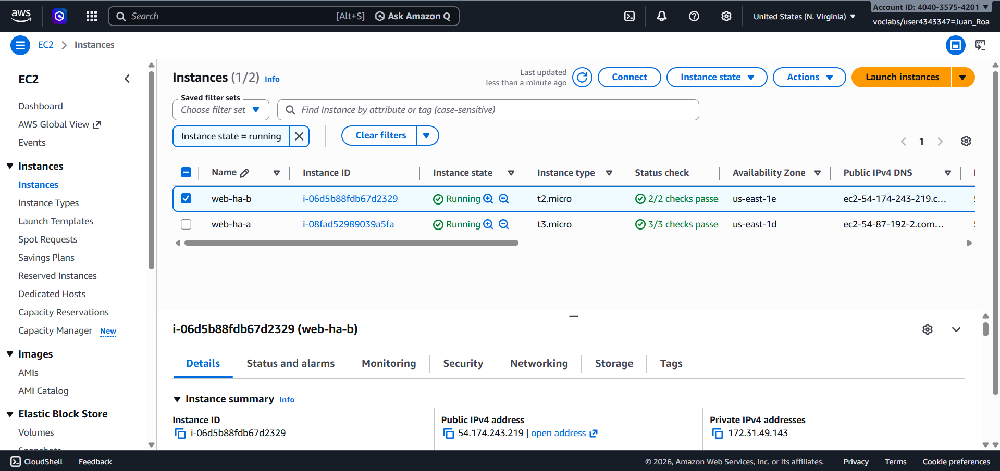
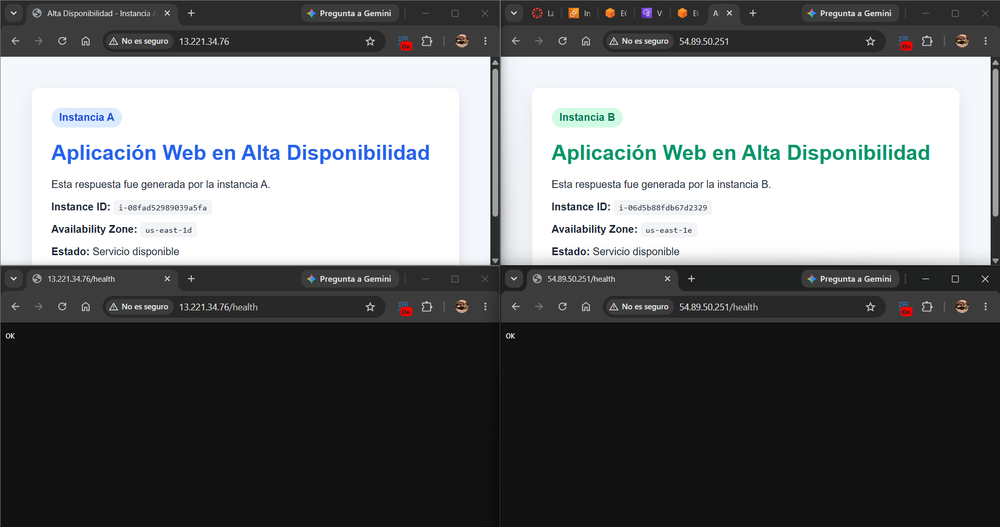
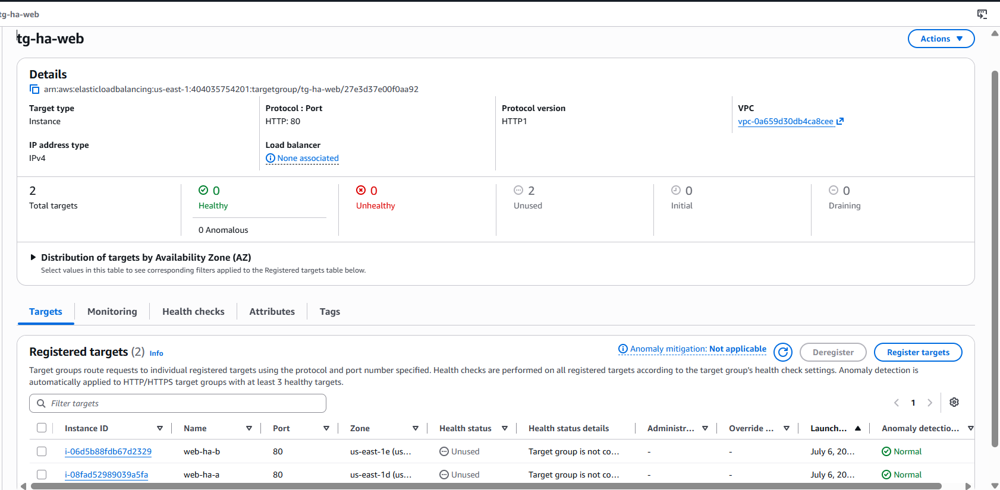
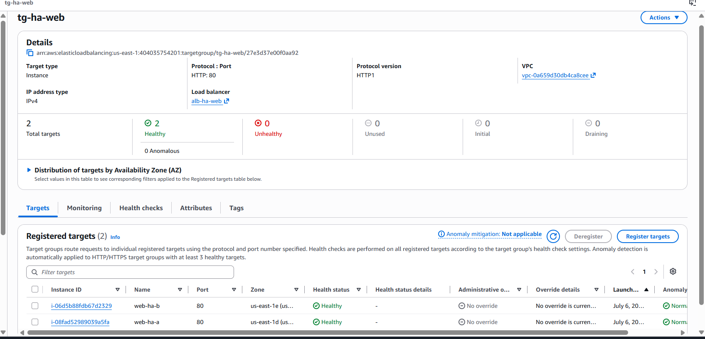
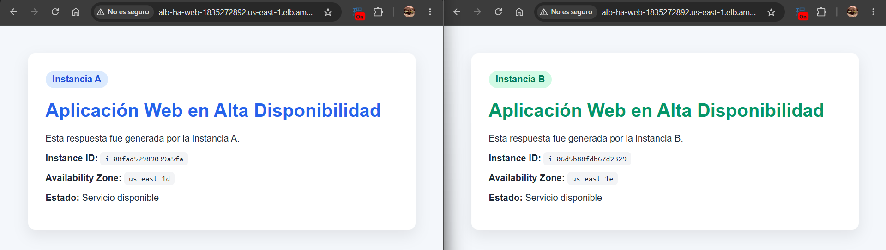
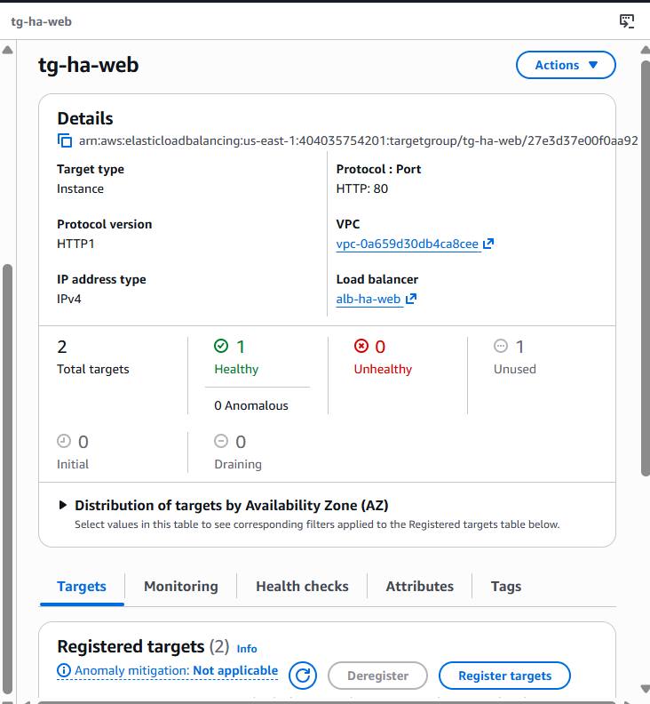
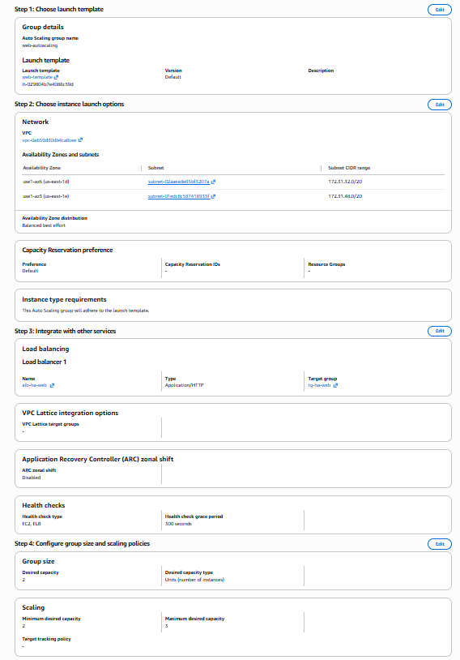
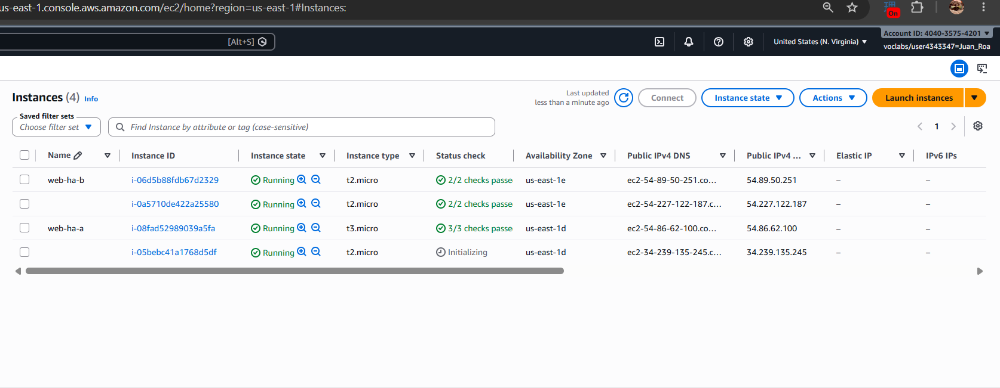

# High-Availability-Lab

ARSW High Availability Lab

## Introducción

En este laboratorio se implementó una arquitectura básica de alta disponibilidad en AWS usando dos instancias EC2, un Target Group y un Application Load Balancer. La idea fue tener más de una instancia disponible para que, si una falla, el sistema pueda seguir respondiendo desde la otra.

---

## Security Groups

Se crearon los grupos de seguridad necesarios para permitir el tráfico HTTP.  
El Security Group del Load Balancer permite entrada por el puerto 80 desde internet, mientras que el Security Group de las instancias permite recibir tráfico HTTP desde el balanceador.

---

## Instancias EC2

Se crearon dos instancias EC2 en AWS.  
Cada instancia representa un servidor web diferente dentro de la arquitectura de alta disponibilidad.

---

## Páginas de las instancias

Se instaló `httpd` en las instancias y se configuró una página web diferente para cada una.  
Esto permite identificar visualmente si responde la instancia A o la instancia B.

También se configuró la ruta `/health`, que responde `OK` y sirve para validar el estado de cada instancia.

---

## Target Group

Se creó un Target Group llamado para agrupar las instancias EC2.  
Este grupo es usado por el Load Balancer para saber a qué instancias puede enviar tráfico.

---

## Targets Healthy

Después de registrar las instancias en el Target Group, ambas aparecieron en estado `Healthy`.  
Esto indica que las instancias responden correctamente al health check configurado en `/health`.

---

## Prueba del Load Balancer

Se probó el DNS del Application Load Balancer desde el navegador.  
Al actualizar varias veces, el balanceador puede responder desde una u otra instancia, mostrando que el tráfico se distribuye entre los servidores disponibles.

---

# Actividad 1

## Análisis del balanceo

### ¿Qué instancia respondió primero?

La primera respuesta vino de una de las dos instancias registradas en el Target Group. En mi caso, se pudo identificar por el mensaje mostrado en la página, donde aparece si respondió la instancia A o la instancia B.

### ¿El balanceador alternó entre ambas instancias?

Sí. Al recargar varias veces el DNS del Load Balancer, se pudo observar que el tráfico no dependía de una sola instancia, sino que podía ser atendido por cualquiera de las dos.

### ¿Qué información permite confirmar que hay más de una instancia activa?

La página muestra información distinta según la instancia que responde, como el nombre de la instancia, el ID de instancia y la zona de disponibilidad. Eso permite confirmar que hay más de una instancia activa respondiendo tráfico.

### ¿Qué papel cumple el Target Group?

El Target Group agrupa las instancias EC2 que pueden recibir tráfico desde el Load Balancer. También permite revisar si cada instancia está saludable mediante health checks.

### ¿Qué papel cumplen los health checks?

Los health checks permiten verificar si una instancia está disponible. Si una instancia no responde correctamente, el Load Balancer puede dejar de enviarle tráfico.

### ¿Por qué el usuario no necesita conocer las IP públicas de las instancias?

Porque el usuario accede mediante el DNS del Load Balancer. El balanceador se encarga de decidir a qué instancia enviar la solicitud, entonces el usuario no necesita conocer las IP individuales.

---

## Simulación de falla

Se detuvo una de las instancias para simular una falla.  
Después de unos minutos, el Target Group detectó que la instancia ya no estaba saludable y dejó de enviarle tráfico.

---

# Actividad 2

## Análisis de falla

### ¿Qué ocurrió cuando se detuvo la instancia A?

La instancia A dejó de responder y el Target Group la marcó como no saludable.

### ¿El sistema completo dejó de estar disponible?

No. El sistema siguió respondiendo porque todavía estaba disponible la instancia B.

### ¿Qué hizo el Load Balancer cuando detectó la falla?

El Load Balancer dejó de enviar tráfico a la instancia que falló y continuó enviando solicitudes a la instancia saludable.

### ¿Qué diferencia habría si solo existiera una instancia?

Si solo existiera una instancia, al detenerse esa instancia el sistema completo dejaría de estar disponible. Esa sería una arquitectura con un punto único de falla.

### ¿Qué atributo de calidad mejora esta arquitectura?

Principalmente mejora la disponibilidad y la tolerancia a fallos, porque el sistema puede seguir funcionando aunque una instancia falle.

---

# Actividad 3

## Análisis de recuperación

### ¿Qué ocurrió cuando la instancia A volvió a estar saludable?

Cuando la instancia A volvió a iniciar y pasó los health checks, el Target Group la marcó nuevamente como saludable.

### ¿El balanceador volvió a enviarle tráfico?

Sí. Cuando la instancia volvió a estar en estado `Healthy`, el Load Balancer pudo volver a enviarle tráfico.

### ¿Por qué es importante que la recuperación sea automática desde el punto de vista del usuario?

Porque el usuario no debería notar manualmente qué instancia está funcionando. Lo ideal es que el sistema se recupere o redirija el tráfico automáticamente sin afectar la experiencia del usuario.

### ¿Qué limitaciones tiene esta arquitectura si la instancia no se reinicia manualmente?

La arquitectura mantiene disponibilidad mientras quede al menos una instancia activa, pero no crea una nueva instancia automáticamente. Si una instancia falla y nadie la reinicia, la capacidad del sistema queda reducida.

---

## Auto Scaling

Se creó una configuración de Auto Scaling usando una Launch Template.  
En el User Data se agregó el script para instalar `httpd`, crear la página web y configurar el endpoint `/health`.

---

## Instancias creadas automáticamente

Con el Auto Scaling Group se crearon instancias automáticamente a partir de la plantilla.  
Esto permite que la arquitectura no dependa únicamente de crear instancias manualmente.

---

## Prueba de Auto Scaling

Se probó nuevamente el acceso a la aplicación usando las instancias creadas por Auto Scaling.  
La página mostró la información de la instancia, confirmando que el script de inicialización funcionó correctamente.

---

## Conclusión

Con este laboratorio se construyó una arquitectura básica de alta disponibilidad en AWS.  
El uso de dos instancias EC2, un Target Group y un Application Load Balancer permite que el sistema siga funcionando aunque una instancia falle.

También se probó una versión mejorada usando Auto Scaling, que permite crear instancias automáticamente a partir de una plantilla, acercando la arquitectura a una solución más realista para producción.